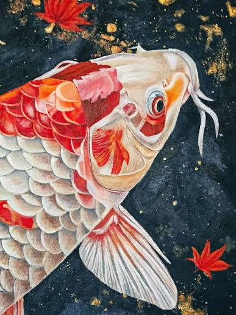
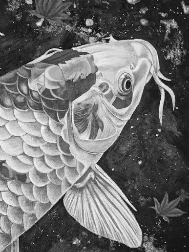
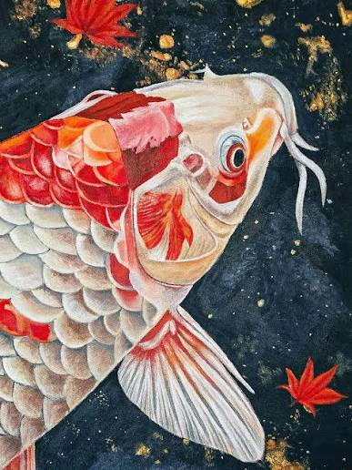
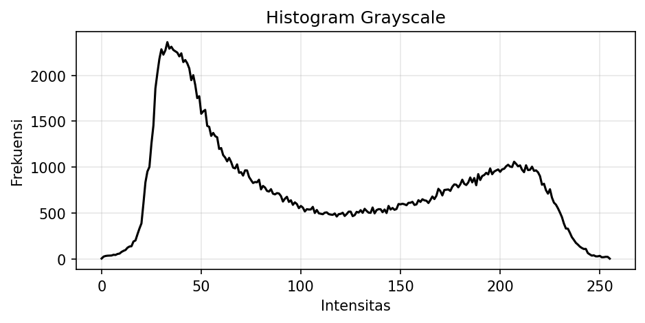
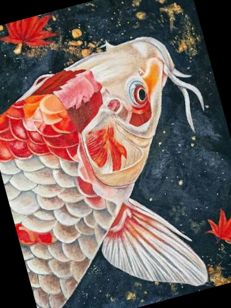

 # Interpretasi Percobaan Digital Image Representation

 ## Library yang Digunakan

 | Library | Alias | Kegunaan |
 |---|---|---|
 | OpenCV | `cv2` | Membaca, mengonversi, memproses, me-resize, memutar, dan menyimpan citra. |
 | NumPy | `np` | Mendukung pengolahan data numerik dan array piksel citra. |
 | Matplotlib | `plt` | Menampilkan citra, membuat subplot, dan menggambar histogram. |
 ## Interpretasi Hasil

Dari percobaan analisis citra yang sudah dilakukan menunjukkan RGB dan HSV berbeda dalam cara merepresentasikan warna, di mana RGB berbasis intensitas cahaya merah, hijau, biru, sedangkan HSV lebih intuitif karena memisahkan hue, saturasi, dan value. OpenCV menggunakan format BGR sehingga gambar bisa tampak salah warna saat ditampilkan di Matplotlib. Histogram grayscale dengan puncak di intensitas rendah menunjukkan banyak area gelap, yang penting untuk memahami kontras citra.

Dalam transformasi ukuran, INTER_LINEAR menghasilkan gambar halus dengan interpolasi bilinear, sedangkan INTER_AREA lebih tepat untuk mengecilkan gambar karena menjaga detail dan mengurangi aliasing. Jika resize dilakukan tanpa menjaga perbandingan panjang‑lebar, bentuk objek bisa berubah dan informasi visual menjadi tidak akurat.

 ## Beberapa Hasil Percobaan

 ### Citra RGB

 

 ### Citra Grayscale

 

  ### Citra HSV

 

 ### Histogram Grayscale

 

 ### Hasil Resize

 

 

 ### Hasil Rotasi

 
